# DigiCare AI Agent 平台 — 功能教學手冊

> 本文件詳細介紹 AI Agent 管理模組與 FHIR TWPAS 癌藥事審表單（含 AI 小幫手）的完整功能與操作方式。

---

## 目錄

- [一、AI Agent 管理模組](#一ai-agent-管理模組)
  - [1. Agent 儀表板](#1-agent-儀表板)
  - [2. 執行狀態](#2-執行狀態)
  - [3. Agent 技能管理](#3-agent-技能管理)
  - [4. Agent 設定](#4-agent-設定)
- [二、FHIR TWPAS 癌藥事審](#二fhir-twpas-癌藥事審)
  - [1. 表單總覽](#1-表單總覽)
  - [2. 工具列按鈕](#2-工具列按鈕)
  - [3. 查詢舊案清單](#3-查詢舊案清單)
  - [4. AI 小幫手](#4-ai-小幫手)
  - [5. 產生 FHIR Bundle 與下載](#5-產生-fhir-bundle-與下載)

---

# 一、AI Agent 管理模組

AI Agent 管理模組提供完整的 Agent 生命週期管理，包含即時監控、技能編排、執行追蹤與系統設定。

---

## 1. Agent 儀表板

**路徑：** `/agent/dashboard`

儀表板為 Agent 系統的總覽頁面，一目了然掌握系統運作狀態。

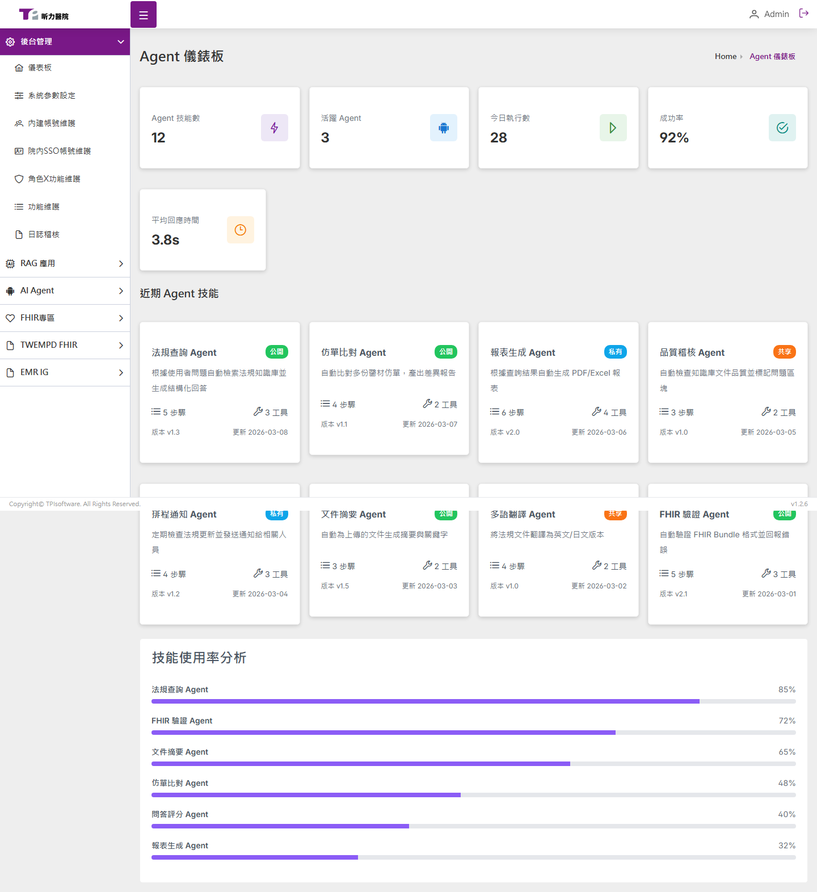

### 1.1 即時統計指標

頁面頂部顯示 5 張統計卡片：

| 指標 | 說明 | 範例值 |
|------|------|--------|
| Agent 技能數 | 系統中已註冊的技能總數 | 12 |
| 活躍 Agent | 目前正在運作的 Agent 數量 | 3 |
| 今日執行數 | 當日已觸發的執行次數 | 28 |
| 成功率 | 執行成功的百分比 | 92% |
| 平均回應時間 | Agent 平均處理耗時 | 3.8s |

每張卡片包含圖示與色彩標示，方便快速辨識。

### 1.2 近期 Agent 技能

以卡片網格呈現系統中最新的 Agent 技能，每張卡片顯示：

- **技能名稱**與**可見性標籤**（公開 / 私有 / 共享）
- 簡短描述（最多兩行）
- 標籤（Tags）
- 版本號、步驟數、工具數

### 1.3 技能使用率分析

以水平進度條呈現各 Agent 技能的使用頻率排名：

| Agent 技能 | 使用率 |
|------------|--------|
| 法規查詢 Agent | 85% |
| FHIR 驗證 Agent | 72% |
| 報表生成 Agent | 65% |
| 品質稽核 Agent | 58% |
| 文件摘要 Agent | 45% |
| 知識圖譜 Agent | 38% |

---

## 2. 執行狀態

**路徑：** `/agent/execution`

即時監控所有 Agent 的執行紀錄，支援狀態篩選與明細查看。

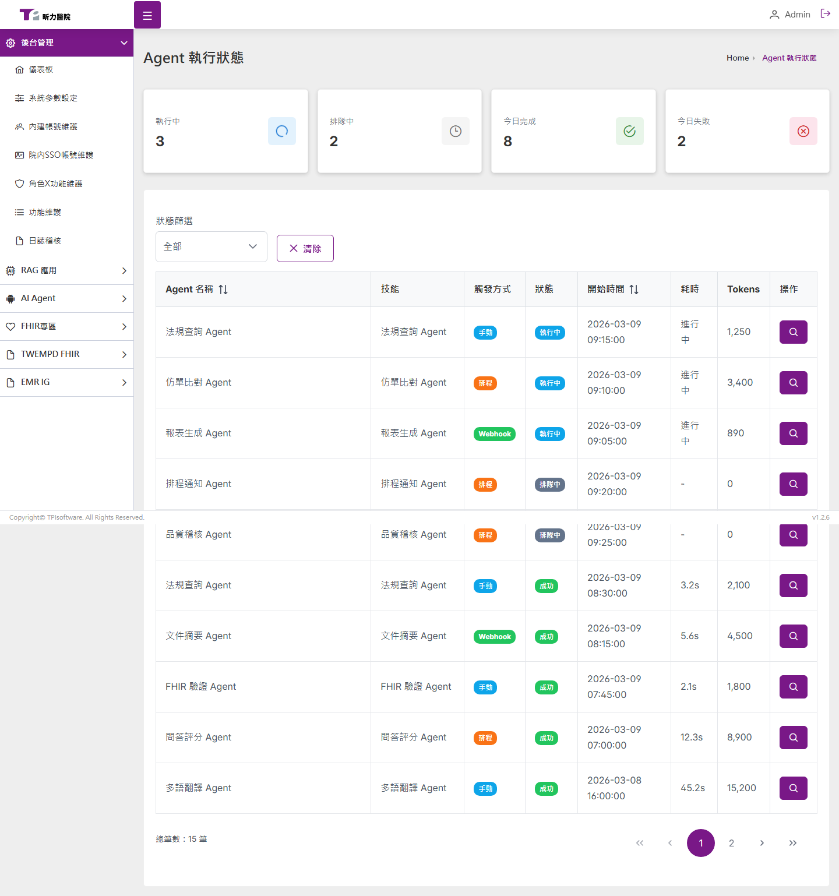

### 2.1 執行摘要

頁面頂部 4 張統計卡片：

| 卡片 | 說明 |
|------|------|
| 執行中 | 目前正在處理的任務數 |
| 排隊中 | 等待執行的任務數 |
| 今日完成 | 當日成功完成的任務數 |
| 今日失敗 | 當日執行失敗的任務數 |

### 2.2 狀態篩選

透過下拉選單篩選執行紀錄：

- **全部** — 顯示所有紀錄
- **執行中** (running) — 藍色標籤
- **成功** (success) — 綠色標籤
- **失敗** (failed) — 紅色標籤
- **排隊中** (queued) — 灰色標籤

點擊「清除」按鈕可重置篩選條件。

### 2.3 執行紀錄表格

DataTable 顯示以下欄位：

| 欄位 | 說明 |
|------|------|
| Agent 名稱 | 執行此任務的 Agent |
| 技能 | 使用的技能名稱 |
| 觸發方式 | Manual（手動）/ Scheduled（排程）/ Webhook |
| 狀態 | 執行狀態（色彩標籤） |
| 開始時間 | 任務啟動時間 |
| 耗時 | 執行總時長 |
| Token 用量 | LLM Token 消耗數 |
| 操作 | 查看明細按鈕 |

支援分頁瀏覽（每頁 10 筆）。

### 2.4 執行明細 Dialog

點擊「查看明細」按鈕後開啟 Dialog，顯示：

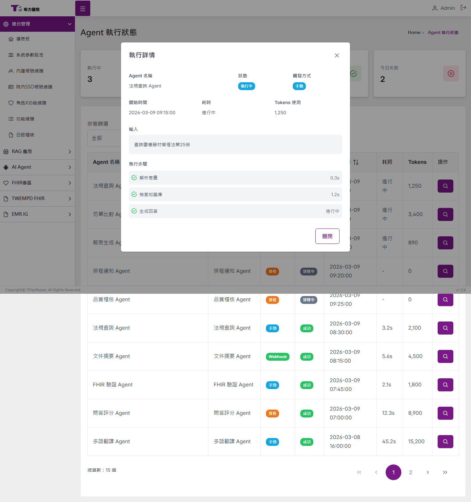

- **基本資訊**：Agent 名稱、狀態、觸發方式、開始時間、耗時、Token 用量
- **Input / Output**：任務的輸入參數與輸出結果
- **執行步驟明細**：每個步驟的名稱、狀態（成功/失敗/跳過）、耗時
- **錯誤訊息**：若任務失敗，顯示錯誤原因

---

## 3. Agent 技能管理

**路徑：** `/agent/skills`

管理 Agent 可使用的技能，支援完整 CRUD 操作，分為三大分頁。

### 3.1 我的技能

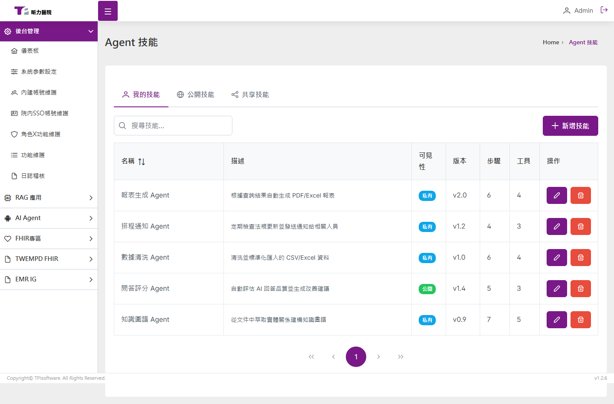

以 DataTable 呈現使用者擁有的技能：

| 欄位 | 說明 |
|------|------|
| 名稱 | 技能名稱 |
| 描述 | 簡短說明（超過 30 字截斷） |
| 可見性 | 私有 / 公開 / 共享（Badge 標示） |
| 版本 | 版本號 |
| 步驟 | 技能包含的步驟數 |
| 工具 | 技能使用的工具數 |
| 操作 | 編輯 / 刪除按鈕 |

**操作功能：**

- **搜尋**：上方搜尋框可依名稱或描述即時過濾
- **新增技能**：點擊「新增技能」按鈕，開啟 Dialog 填寫：
  - 技能名稱（必填）
  - 描述
  - 可見性（私有 / 公開 / 共享）
  - 標籤（逗號分隔）
- **編輯技能**：點擊鉛筆圖示，Dialog 預填現有資料供修改
- **刪除技能**：點擊垃圾桶圖示，確認後刪除

### 3.2 公開技能

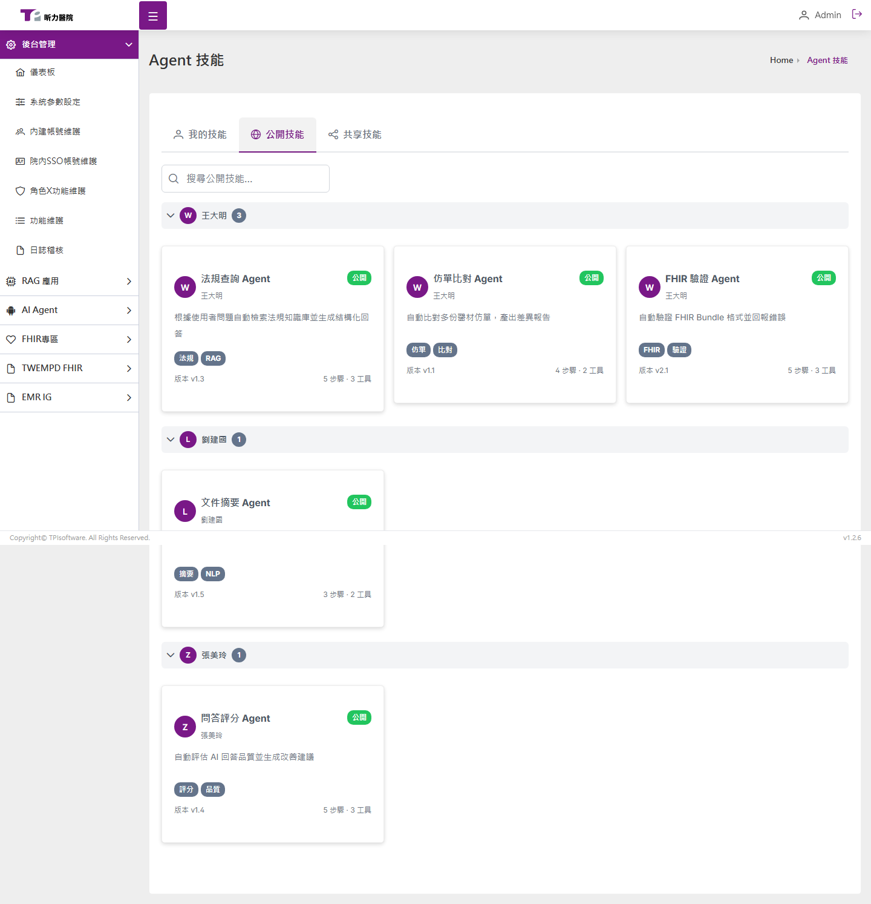

以卡片形式展示所有公開技能，**依擁有者分群**：

- 每個擁有者顯示頭像、名稱、技能數量
- 點擊可收合/展開該擁有者的技能列表
- 每張卡片顯示：技能名稱、描述、標籤、版本、步驟/工具數

### 3.3 共享技能

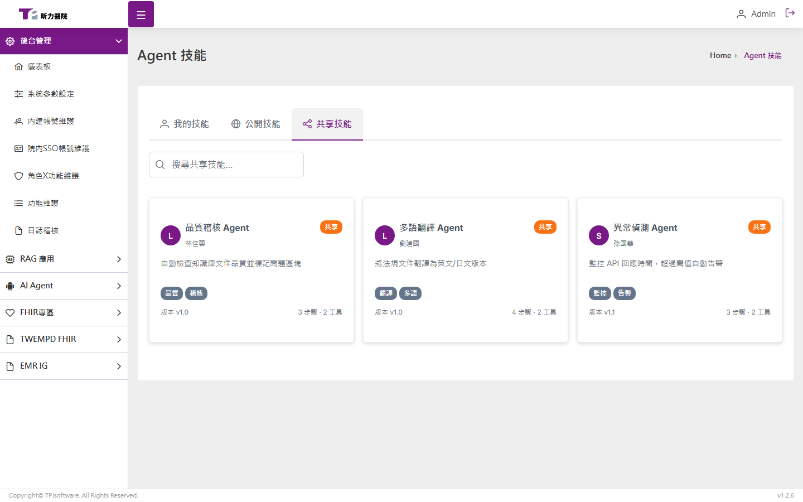

以卡片網格展示其他使用者共享的技能，格式同公開技能卡片。

---

## 4. Agent 設定

**路徑：** `/agent/settings`

Agent 完整設定頁，包含啟停控制、執行參數、日誌、功能開關、Webhook、排程等設定，以 Accordion 手風琴分區呈現。

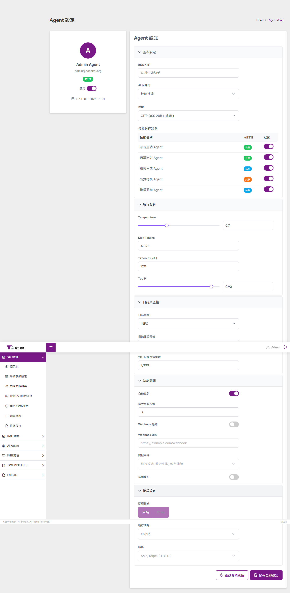

### 4.1 Agent Profile（左欄）

左側卡片顯示 Agent 基本資訊與啟停總開關：

| 項目 | 說明 |
|------|------|
| 頭像 | 紫色圓形 Avatar |
| 顯示名稱 | Agent 名稱（如 Admin Agent） |
| Email | 聯絡信箱 |
| 狀態 Badge | 啟用中（綠色）/ 已停用（紅色） |
| 啟用/停用開關 | InputSwitch，停用後右欄所有設定項 disabled |
| 加入日期 | 帳號建立日期 |

### 4.2 基本設定（Panel 1）

| 設定項 | 類型 | 選項 |
|--------|------|------|
| 顯示名稱 | 文字輸入 | 自由填寫 |
| AI 供應商 | 下拉選單 | OpenAI / Azure OpenAI / 地端推論 |
| 模型 | 下拉選單 | GPT-OSS 20B / GPT-OSS 120B / LLaMA-Vision 90B / Claude 4 Sonnet / GPT-4o |

**技能啟停狀態 DataTable**：列出所有 Agent 技能，每列可獨立啟用/停用，顯示技能名稱、可見性 Badge（公開/私有/共享）及狀態開關。

### 4.3 執行參數（Panel 2）

| 設定項 | 元件 | 預設值 | 範圍 |
|--------|------|--------|------|
| Temperature | Slider + InputNumber | 0.7 | 0–2，step 0.1 |
| Max Tokens | InputNumber | 4096 | 256–32768 |
| Timeout（秒） | InputNumber | 120 | 10–600 |
| Top P | Slider + InputNumber | 0.9 | 0–1，step 0.05 |

### 4.4 日誌與監控（Panel 3）

| 設定項 | 元件 | 預設值 |
|--------|------|--------|
| 日誌等級 | Dropdown | INFO（可選 DEBUG / INFO / WARN / ERROR） |
| 日誌保留天數 | InputNumber | 30 |
| 執行紀錄保留筆數 | InputNumber | 1000 |

### 4.5 功能開關（Panel 4）

| 設定項 | 元件 | 預設值 | 說明 |
|--------|------|--------|------|
| 自動重試 | InputSwitch | ON | 關閉時「最大重試次數」disabled |
| 最大重試次數 | InputNumber | 3 | |
| Webhook 通知 | InputSwitch | OFF | 關閉時 URL / 觸發事件 disabled |
| Webhook URL | InputText | （空） | |
| 觸發事件 | MultiSelect | 全部 | 成功 / 失敗 / 逾時 |
| 排程執行 | InputSwitch | OFF | 啟用後 Panel 5 可操作 |

### 4.6 排程設定（Panel 5）

| 設定項 | 元件 | 預設值 |
|--------|------|--------|
| 排程模式 | SelectButton | 間隔（可切換為 Cron） |
| 執行間隔 | Dropdown | 每小時（間隔模式時顯示） |
| Cron 表達式 | InputText | `0 0 * * *`（Cron 模式時顯示） |
| 時區 | Dropdown | Asia/Taipei (UTC+8) |

排程執行功能開關關閉時，整個 Panel 內容 disabled。

### 4.7 操作按鈕

- **儲存全部設定**：儲存完成後顯示 Toast 成功提示
- **重設為預設值**：點擊後彈出確認 Dialog，確認後恢復所有設定為預設值

---

# 二、FHIR TWPAS 癌藥事審

**路徑：** `/fhir/twpas`

TWPAS（Taiwan Pre-Authorization System）為癌藥事前審查系統，本平台提供完整的 TWPAS IG 1.1.0 版本表單，支援填寫、驗證、產生 FHIR Bundle 與 AI 輔助建議。

---

## 1. 表單總覽

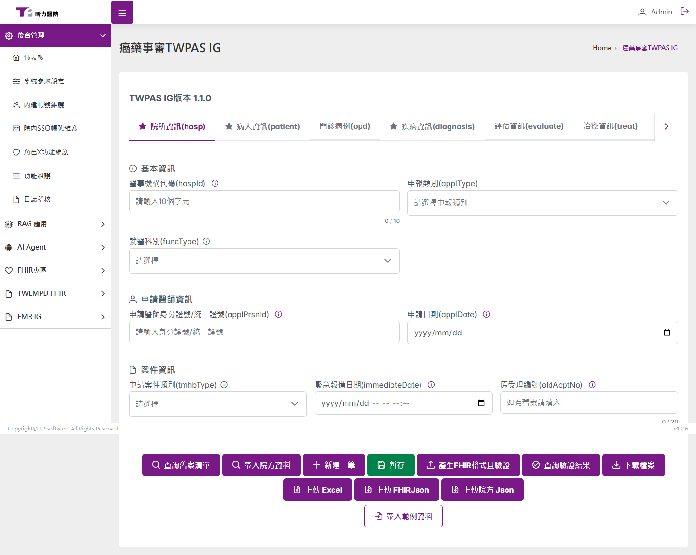

表單分為 **9 個分頁**，必填分頁以星號（★）標示：

| 分頁 | 代碼 | 必填 | 說明 |
|------|------|------|------|
| 院所資訊 | hosp | ★ | 醫療院所基本資料 |
| 病人資訊 | patient | ★ | 病人基本資料 |
| 門診病例 | opd | | 門診紀錄 |
| 疾病資訊 | diagnosis | ★ | 影像檢查、癌症分期、檢查報告 |
| 評估資訊 | evaluate | | 檢驗項目、病人評估 |
| 治療資訊 | treat | | 治療計畫與用藥 |
| 基因資訊 | gene | | 基因檢測結果 |
| 結果資訊 | result | | 審查結果 |
| 申請項目 | apply | ★ | 申請藥品與項目 |

---

## 2. 工具列按鈕

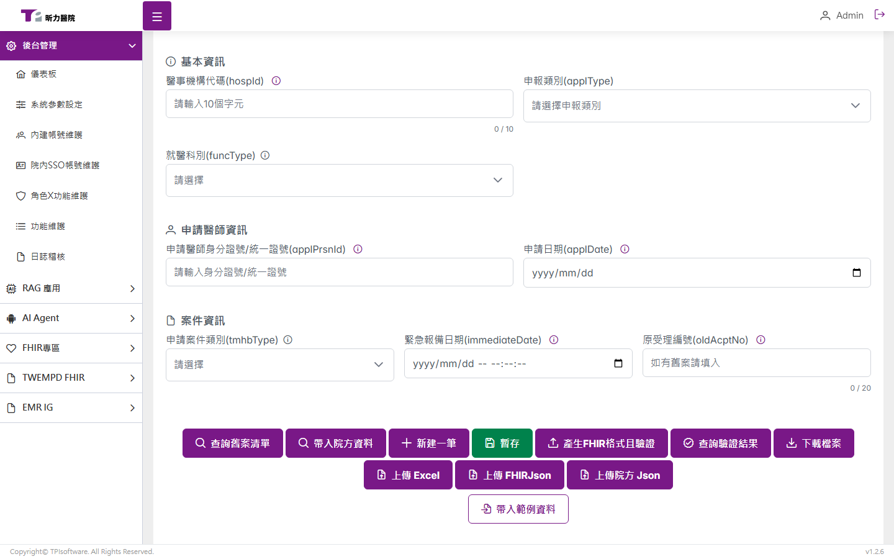

表單下方提供 10 個操作按鈕（另有 1 個 Demo 輔助按鈕）：

| 按鈕 | 圖示 | 功能說明 |
|------|------|----------|
| 查詢舊案清單 | 🔍 | 開啟舊案查詢 Dialog，可帶入歷史資料 |
| 帶入院方資料 | 🔍 | 從院方系統帶入資料（需後端串接） |
| 新建一筆 | ➕ | 清空表單，重新填寫（會確認是否放棄目前資料） |
| 暫存 | 💾 | 暫時儲存目前表單狀態 |
| 產生 FHIR 格式且驗證 | 📤 | 將表單轉為 FHIR Bundle 並執行驗證 |
| 查詢驗證結果 | ✅ | 查詢 FHIR Server 上的驗證結果（需後端串接） |
| 下載檔案 | 📥 | 開啟下載選項 Dialog |
| 上傳 Excel | 📄 | 上傳 Excel 格式資料（需後端串接） |
| 上傳 FHIRJson | 📄 | 上傳 FHIR JSON 格式資料（需後端串接） |
| 上傳院方 Json | 📄 | 上傳院方自定義 JSON（需後端串接） |
| **帶入範例資料** | 📋 | （Demo 用）一鍵填入完整範例資料 |

---

## 3. 查詢舊案清單

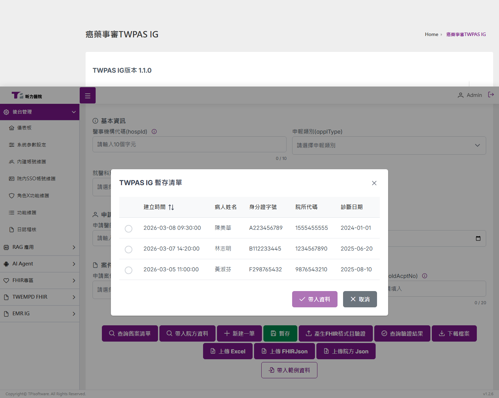

### 操作步驟

1. **點擊「查詢舊案清單」按鈕**
   開啟查詢 Dialog，顯示歷史案件清單。

2. **選擇案件**
   DataTable 中列出已儲存的案件，顯示：
   - 病人姓名
   - 身分證字號
   - ICD-10 診斷碼
   - 建立日期
   - 最後修改日期

3. **確認帶入**
   選擇案件後點擊「確認帶入」，系統顯示確認 Dialog：
   > 是否帶入 [病人姓名] 的案件資料？（建立於 YYYY-MM-DD）

4. **資料自動填入**
   確認後，表單所有欄位自動填入該案件的歷史資料，並顯示成功提示。

### Demo 內建案例

| 案例 | 診斷 | 說明 |
|------|------|------|
| 陳美華 | C34.1 肺癌 NSCLC Stage IIIA | 非小細胞肺癌第三期 |
| 林志明 | C34.9 肺癌 EGFR 突變 | EGFR 基因突變陽性 |
| 黃淑芬 | C50.9 乳癌 HER2 陽性 | HER2 陽性乳癌 |

---

## 4. AI 小幫手

### 功能概述

AI 小幫手是 TWPAS 表單中的**欄位級 AI 輔助建議功能**。在特定臨床欄位旁邊設有機器人圖示按鈕，點擊後開啟右側 Sidebar，根據當前表單中的診斷、用藥、基因檢測等臨床資料，以 Markdown 格式即時串流產生對應建議。

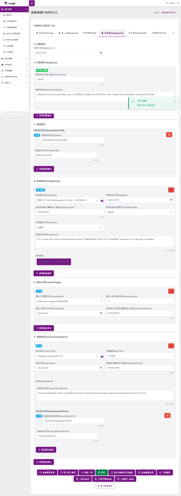

### 支援欄位

AI 小幫手目前支援以下 3 個欄位：

#### (1) 影像報告項目 (imgItem)

- **位置**：疾病資訊 → 影像檢查 → 影像報告項目 Dropdown 旁
- **建議內容**：依據 ICD-10 診斷碼，建議應執行的影像檢查項目
- **輸出格式**：
  - 案件摘要（診斷碼、用藥、基因結果）
  - 建議影像項目表格（優先序、ICD-10-PCS 代碼、項目名稱、建議理由）
  - 臨床說明（為何需要該檢查）
  - 追蹤建議（後續追蹤頻率）

**範例建議**（以肺癌 C34 為例）：

| 優先序 | 代碼 | 項目 | 理由 |
|--------|------|------|------|
| 1 | BW23ZZZ | 胸部 X 光 | 評估肺部病灶大小 |
| 2 | BW24ZZZ | 胸部電腦斷層 | 精確評估腫瘤範圍與分期 |
| 3 | BF23ZZZ | 腹部電腦斷層 | 排除腹部轉移 |
| 4 | BN20ZZZ | 骨骼掃描 | 排除骨轉移 |
| 5 | BW30ZZZ | 腦部核磁共振 | NSCLC 需排除腦轉移 |

#### (2) 檢驗名稱 / 套組代碼 (inspect)

- **位置**：評估資訊 → 檢驗項目 → 檢驗名稱 Dropdown 旁
- **建議內容**：依據用藥計畫與基因結果，建議應執行的檢驗項目
- **輸出格式**：
  - 案件摘要
  - 基礎檢驗表格（LOINC 代碼、檢驗名稱、頻率、臨床意義）
  - 藥物安全監測項目
  - 療效生物標記
  - 特殊監測項目

**範例建議**（以肺癌合併 EGFR 突變為例）：

| LOINC | 檢驗項目 | 頻率 | 臨床意義 |
|-------|----------|------|----------|
| 26464-8 | CBC 全血球計數 | 每週期 | 監測骨髓抑制 |
| 718-7 | 血紅素 | 每週期 | 評估貧血 |
| 2160-0 | 肌酸酐 | 用藥前、每月 | 腎功能監測 |
| 1920-8 | AST | 用藥前、每月 | 肝功能監測 |

#### (3) 報告類型 (reportType)

- **位置**：疾病資訊 → 檢查報告 → 報告類型 Dropdown 旁
- **建議內容**：依據診斷與治療計畫，建議應附上的報告類型
- **輸出格式**：
  - 案件摘要
  - 必要報告（一定要附的報告）
  - 強烈建議報告（加速審查的報告）
  - 輔助報告（支持性資料）
  - 送審提醒

### 操作步驟

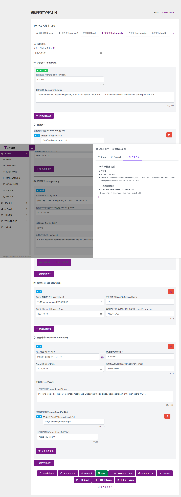

1. **先填入或帶入表單資料**
   建議先透過「帶入範例資料」或「查詢舊案清單」填入臨床資料，讓 AI 能根據實際資料產生建議。

2. **點擊機器人圖示**
   在支援的欄位旁找到紫色機器人圖示（🤖），點擊即可。

3. **AI Sidebar 開啟**
   右側滑出 Sidebar，自動切換至「AI 建議回覆」分頁，開始串流顯示建議內容。

4. **瀏覽 AI 建議**
   Sidebar 提供 3 個分頁：

   | 分頁 | 說明 |
   |------|------|
   | Data | 當前表單完整資料（JSON 格式，供除錯使用） |
   | Prompt | 該欄位的 AI System Prompt（說明 AI 的角色與任務） |
   | AI 建議回覆 | AI 產生的建議內容（Markdown 格式，含表格、列表、粗體） |

5. **串流顯示效果**
   AI 回覆以逐字打字效果呈現，模擬真實 LLM 串流輸出。串流期間顯示游標動畫（▍）。

6. **重新生成**
   串流完成後，可點擊「重新生成」按鈕重新產生建議。

### 技術特性

- **上下文感知**：AI 回覆依據表單中的 ICD-10 診斷碼、用藥代碼、基因檢測結果等臨床資料動態產生
- **隱私保護**：AI 建議內容不包含病人個資（姓名、身分證字號、性別、院所代號等），僅使用臨床資料
- **Markdown 渲染**：建議內容以 Markdown 格式呈現，支援表格、粗體、列表、引用區塊等格式
- **診斷別建議**：不同診斷碼（如 C34 肺癌、C50 乳癌）會產生不同的建議內容

---

## 5. 產生 FHIR Bundle 與下載

### 產生 FHIR 格式且驗證

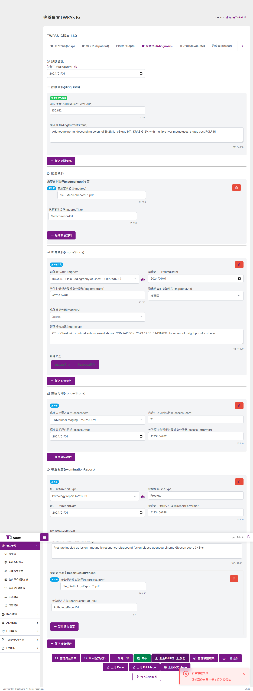

1. 點擊工具列「產生 FHIR 格式且驗證」按鈕
2. 系統將表單資料轉換為 FHIR R4 Bundle（包含 Composition、Patient、Condition、MedicationRequest 等 Resource）
3. 開啟 Dialog 顯示產生的 FHIR JSON
4. 可點擊「複製」按鈕將 JSON 複製到剪貼簿

### 下載檔案

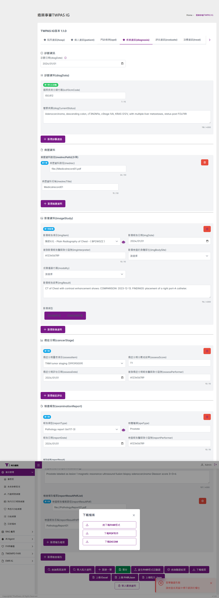

點擊「下載檔案」按鈕後，開啟下載 Dialog，提供 3 種格式選項：

| 格式 | 說明 |
|------|------|
| FHIR JSON | 下載 FHIR Bundle JSON 檔案 |
| 原始表單 JSON | 下載表單原始資料 JSON |
| PDF | 下載 PDF 格式報告 |

選擇格式後點擊「下載」即可。

---

## 附錄：路由總覽

| 路徑 | 頁面 | 模組 |
|------|------|------|
| `/agent/dashboard` | Agent 儀表板 | AI Agent |
| `/agent/execution` | 執行狀態 | AI Agent |
| `/agent/skills` | Agent 技能管理 | AI Agent |
| `/agent/settings` | Agent 設定 | AI Agent |
| `/fhir/twpas` | 癌藥事審 TWPAS | FHIR 專區 |
